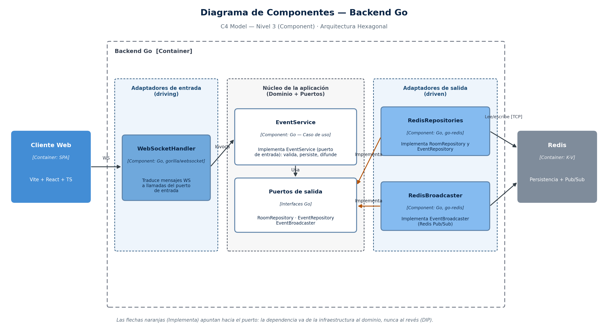

# Sistema de Salas en Tiempo Real — Arquitectura Hexagonal

Proyecto de la asignatura de Arquitectura de Software (Presentación 1: *Exploración de estilos arquitectónicos y stack tecnológico*).

## Descripción del sistema

Aplicación de **salas de eventos en tiempo real**: los usuarios crean o se unen a una sala y todo mensaje publicado llega al instante a los demás participantes de esa sala. El historial se guarda en Redis, por lo que quien entra después ve los mensajes anteriores.

Caso de uso de extremo a extremo: `crear sala → unirse → publicar evento → difusión en tiempo real → consultar historial`.

- **Estilo arquitectónico:** Arquitectura Hexagonal (Ports & Adapters)
- **Entidades de negocio:** `Room` 1—N `Participant`, `Room` 1—N `Event`



## Tecnologías usadas

| Capa | Tecnología |
|---|---|
| Frontend | Vite + React 18 + TypeScript |
| Backend | Go 1.22 (`net/http`, `gorilla/websocket`, `go-redis`) |
| Persistencia | Redis 7 (clave-valor, Pub/Sub, AOF) |
| Protocolo de integración | WebSocket con mensajes JSON |
| Contenedores | Docker + Docker Compose (nginx para servir la SPA) |
| Pruebas | `go test`, Vitest |

## Pasos para el despliegue

**Requisitos:** Docker Desktop (o Docker Engine con el plugin Compose) y los puertos `5173`, `8080` y `6379` libres.

```bash
git clone <URL-DEL-REPOSITORIO>
cd proyecto-hexagonal
docker compose up --build
```

Cuando termine de construir:

| Servicio | URL |
|---|---|
| Aplicación web | http://localhost:5173 |
| Salud del backend | http://localhost:8080/healthz (responde `ok`) |

Para apagar: `Ctrl + C` y luego `docker compose down` (agrega `-v` para borrar también los datos de Redis).

### Probar el flujo principal

1. Abre http://localhost:5173 en **dos pestañas** del navegador.
2. En la pestaña 1: escribe un nombre (por ejemplo *Ana*), crea una sala y entra.
3. En la pestaña 2: escribe otro nombre (*Beto*) y entra a la **misma sala**.
4. Envía un mensaje desde una pestaña: debe aparecer **al instante** en la otra.
5. Recarga una pestaña y vuelve a entrar a la sala: el historial sigue ahí (persistencia en Redis).
6. Envía un mensaje vacío: el sistema lo rechaza con un error y no se cae.

Ver los datos guardados:

```bash
docker compose exec redis redis-cli --scan --pattern 'hexagonal:*'
```

## Ejecutar las pruebas

```bash
# Backend: pruebas unitarias (no requieren Docker ni Redis)
cd backend
go test ./...

# Backend: incluye la prueba de integración con Redis real
docker run --rm -d --name redis-test -p 6379:6379 redis:7-alpine
REDIS_ADDR=localhost:6379 go test -race -count=1 ./...
docker stop redis-test

# Frontend
cd ../frontend
npm ci
npm test
```

> La prueba de integración solo corre si `REDIS_ADDR` está definido; sin él se omite automáticamente.

## Ejecución sin Docker (desarrollo)

```bash
redis-server                                   # terminal 1
cd backend && go run ./cmd/server              # terminal 2  (escucha en :8080)
cd frontend && npm install && npm run dev      # terminal 3  (http://localhost:5173)
```

## Estructura del repositorio

```
backend/     Go: dominio, puertos, servicio de aplicación y adaptadores
frontend/    Vite + React + TypeScript
docs/        Documento técnico, diagramas (HLD y C4) y ADRs
docker-compose.yml
```

## Documentación

- Documento técnico completo: [`docs/investigacion.md`](docs/investigacion.md)
- Decisiones de arquitectura (ADR): [`docs/adr/`](docs/adr/)
- Diagramas: [`docs/diagramas/`](docs/diagramas/)
- Detalle del backend: [`backend/README.md`](backend/README.md)

## Protocolo WebSocket (`ws://localhost:8080/ws`)

| Cliente → servidor | Campos |
|---|---|
| `list_rooms` | — |
| `create_room` | `name` |
| `join` | `roomId`, `name` |
| `publish` | `payload` (máx. 2000 caracteres) |

| Servidor → cliente | Contenido |
|---|---|
| `rooms` | lista de salas |
| `room_created` | sala creada |
| `joined` | participante + historial de la sala |
| `event` | evento publicado (llega a todos los de la sala) |
| `error` | `message` legible |

## Autores

### Sebastian Fonseca
### Damian Rey
### Samuel Tovar
