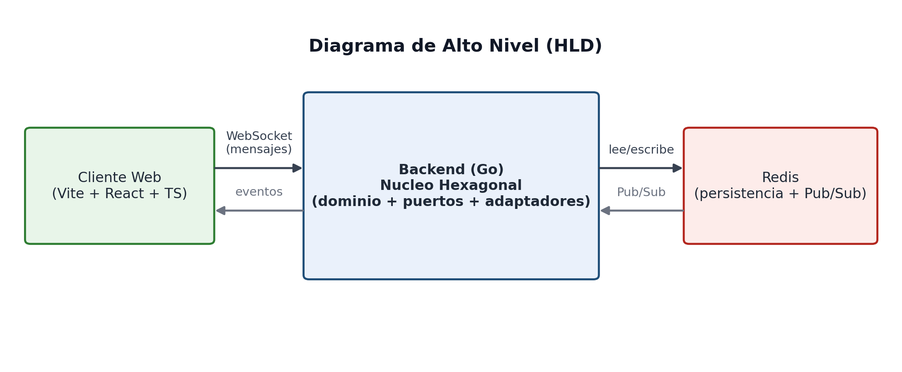

[investigacion.md](https://github.com/user-attachments/files/32448733/investigacion.md)

# Arquitectura Hexagonal (Ports & Adapters)

**Stack:** Vite + React + TypeScript · Go (Golang) · Redis · WebSocket

Documento técnico — Presentación 1: Exploración de Estilos Arquitectónicos y Stack Tecnológico
*Avance 1: Investigación, primer avance de análisis, diseño e implementación*

---

## 1. Investigación del Estilo Arquitectónico: Arquitectura Hexagonal

### 1.1 Definición

**Qué es:** un estilo arquitectónico propuesto por Alistair Cockburn (2005) que organiza el sistema en tres zonas concéntricas: un núcleo de dominio (lógica de negocio pura), una capa de puertos (interfaces que declaran cómo el núcleo se comunica hacia afuera) y una capa de adaptadores (implementaciones concretas que conectan esos puertos con tecnologías reales como HTTP, WebSocket, bases de datos o colas de mensajes). El objetivo central es que el dominio no dependa de ningún detalle de infraestructura.

**Qué no es:** no es un framework, ni una librería, ni exige una tecnología específica; tampoco es sinónimo de microservicios (se puede aplicar dentro de un monolito) ni de Clean/Onion Architecture, aunque comparte con ellas el principio de inversión de dependencias hacia el dominio.

### 1.2 Clasificación del estilo

Pertenece a la familia de arquitecturas de dominio o "círculos concéntricos", junto con Onion Architecture y Clean Architecture. Es un estilo estructural (organiza la lógica interna del sistema), no distribuido ni de datos; puede combinarse con cualquier estilo distribuido (monolito, microservicios, serverless) porque solo regula cómo se organiza el código dentro de un componente.

### 1.3 Características principales

- **Puertos (Ports):** interfaces definidas por el dominio que describen qué necesita o qué expone, sin saber cómo se implementa (ej. una interfaz Repository, o una interfaz Notifier).
- **Adaptadores (Adapters):** implementaciones concretas de un puerto. Se dividen en adaptadores de entrada/driving (quien usa el sistema: un controlador REST, un handler de WebSocket) y de salida/driven (lo que el sistema usa: un repositorio en Redis, un cliente HTTP externo).
- **Independencia del dominio:** el núcleo de negocio no importa librerías de frameworks, drivers de base de datos ni SDKs externos; solo conoce sus propios puertos.
- **Simetría:** a diferencia de una arquitectura en capas clásica, no hay una dirección única "arriba-abajo"; el dominio queda en el centro y todo apunta hacia él (Regla de Dependencia).
- **Alta testeabilidad:** el dominio se puede probar con pruebas unitarias puras, sustituyendo los adaptadores por dobles de prueba (mocks/stubs) de los puertos.

### 1.4 Historia y evolución

Propuesta por Alistair Cockburn en 2005 bajo el nombre "Ports and Adapters", como respuesta al problema de que la arquitectura en capas tradicional terminaba acoplando la lógica de negocio a la interfaz de usuario y a la base de datos. La idea del dominio aislado influyó directamente en Robert C. Martin para formalizar Clean Architecture (2012) y en Jeffrey Palermo para Onion Architecture (2008); las tres comparten la misma regla de dependencia hacia el centro, con distinta nomenclatura de capas. Con la llegada de microservicios y contenedores (2015 en adelante), Hexagonal se popularizó como el estilo por defecto para diseñar cada servicio individual, ya que facilita cambiar de protocolo de entrada (REST, gRPC, WebSocket) o de motor de persistencia sin tocar el dominio.

### 1.5 Ventajas y desventajas

| Ventajas | Desventajas |
|---|---|
| Alta testeabilidad del dominio sin infraestructura real | Curva de aprendizaje más alta para equipos junior |
| Facilita cambiar tecnología (ej. cambiar WebSocket por REST, o Redis por Postgres) sin tocar la lógica de negocio | Más archivos/carpetas e indirecciones que un CRUD simple; puede sentirse como sobre-ingeniería en proyectos muy pequeños |
| Bajo acoplamiento y alta cohesión; cumple bien SRP y DIP | Requiere disciplina del equipo para no "filtrar" detalles de infraestructura al dominio |
| Permite convivir varios adaptadores de entrada a la vez (ej. WebSocket y REST) reutilizando el mismo dominio | El mapeo entre modelos de dominio y modelos de infraestructura (DTOs) añade código repetitivo |

### 1.6 Problemas comunes y patrones asociados

- **Fuga de infraestructura al dominio:** ocurre cuando structs de la base de datos o tipos de un framework se usan directamente en el dominio; se evita con DTOs y mapeadores en los adaptadores.
- **Puertos mal diseñados (demasiado amplios):** un puerto que expone detalles técnicos (ej. paginación con cursores propios de Redis) rompe la abstracción; se corrige aplicando Interface Segregation.
- **Patrones que suele necesitar este estilo:** Dependency Injection (para inyectar adaptadores en tiempo de arranque), Repository (puerto de salida hacia persistencia), Adapter (patrón GoF, base conceptual del estilo), Facade (para exponer casos de uso del dominio a los adaptadores de entrada) y, en este proyecto, Observer/Publish-Subscribe para el canal de WebSocket.

### 1.7 Casos de uso

**Cuándo usarlo:** cuando la lógica de negocio es valiosa y debe sobrevivir a cambios tecnológicos; cuando se prevén múltiples canales de entrada (API REST + WebSocket + CLI) o múltiples proveedores de persistencia; cuando se requiere probar el dominio de forma aislada y rápida.

**Cuándo no usarlo:** en prototipos desechables, scripts pequeños o CRUDs triviales donde el costo de las capas adicionales no se justifica frente al beneficio de flexibilidad futura.

### 1.8 Casos de aplicación reales

- Netflix y otras plataformas de streaming aíslan su lógica de recomendación/negocio de los adaptadores hacia distintos proveedores de datos y colas de eventos.
- Equipos que migran de monolito a microservicios suelen introducir Hexagonal primero dentro del monolito (Strangler Fig) para poder extraer servicios sin reescribir el dominio.
- Es el estilo recomendado por la comunidad de Go (proyectos como "go-kit" y ejemplos oficiales de Domain-Driven Design en Go) para separar handlers HTTP/WebSocket del núcleo de negocio.

---

## 2. Investigación del Stack Tecnológico

### 2.1 Frontend — Vite + React + TypeScript

**Qué es / qué no es:** Vite es una herramienta de build y servidor de desarrollo (no un framework de UI); React es una librería para construir interfaces basadas en componentes y Virtual DOM (no un framework integral como Angular); TypeScript es un superconjunto tipado de JavaScript que se transpila a JS (no un lenguaje distinto en tiempo de ejecución).

**Características principales:** Vite usa ESBuild/Rollup y servidores de módulos nativos (ESM) para arranque casi instantáneo y Hot Module Replacement muy rápido; React aporta un modelo declarativo de componentes y hooks para manejar estado y efectos; TypeScript aporta tipado estático, autocompletado y detección de errores en tiempo de compilación.

**Historia y evolución:** React nace en Facebook (2013); Vite es creado por Evan You (autor de Vue) en 2020 como alternativa a Webpack, hoy es el bundler recomendado por el propio equipo de React para nuevos proyectos SPA; TypeScript es de Microsoft (2012) y hoy es el estándar de facto para proyectos React de tamaño mediano/grande.

**Ventajas y desventajas:** Ventajas: arranque y recarga extremadamente rápidos, tipado que reduce errores en tiempo de ejecución, enorme ecosistema y talento disponible. Desventajas: Vite/React puro no incluye SSR (a diferencia de Next.js), por lo que el enrutamiento y el SEO deben resolverse aparte; TypeScript añade una etapa de compilación y curva de aprendizaje de tipos.

**Casos de uso:** ideal para SPAs y dashboards interactivos como el cliente de una aplicación en tiempo real sobre WebSocket, donde no se requiere SSR/SEO. No es la mejor opción si el proyecto necesita renderizado en servidor o generación estática (ahí conviene un meta-framework como Next.js o Astro).

**Casos de aplicación:** usado como stack de frontend en herramientas internas, paneles de administración y clientes de aplicaciones colaborativas en tiempo real (chats, tableros compartidos, dashboards de monitoreo).

### 2.2 Backend — Go (Golang)

**Qué es / qué no es:** Go es un lenguaje de programación compilado, con tipado estático y concurrencia nativa (goroutines y channels), creado por Google. No es un framework; para este proyecto se usa con su librería estándar (net/http, encoding/json) más una librería ligera de WebSocket (ej. gorilla/websocket o nhooyr.io/websocket).

**Características principales:** compilación a binario único sin dependencias externas, concurrencia ligera mediante goroutines (miles de conexiones concurrentes con bajo consumo de memoria), tipado estático con inferencia, recolector de basura, y una librería estándar muy completa para HTTP y JSON.

**Historia y evolución:** creado en Google por Robert Griesemer, Rob Pike y Ken Thompson, publicado en 2009 y estable desde 2012; su modelo de concurrencia lo hizo el lenguaje por defecto para infraestructura cloud-native (Docker, Kubernetes y Terraform están escritos en Go).

**Ventajas y desventajas:** Ventajas: rendimiento cercano a C, manejo nativo de miles de conexiones concurrentes (ideal para servidores WebSocket), despliegue simple (un solo binario, contenedores muy livianos). Desventajas: sintaxis más verbosa para manejo de errores (`if err != nil` repetido), ecosistema de frameworks web más minimalista que en Java/Node, sin genéricos completos hasta versiones recientes.

**Casos de uso:** excelente para backends con alta concurrencia y comunicación en tiempo real como servidores WebSocket, proxies, APIs de baja latencia. Menos indicado cuando se requiere un ecosistema ORM/ADMIN muy maduro tipo Django o Rails para CRUDs administrativos complejos.

**Casos de aplicación:** Docker, Kubernetes, Cloudflare, y buena parte de la infraestructura de mensajería en tiempo real de empresas como Uber y Twitch usan Go precisamente por su capacidad de sostener muchas conexiones WebSocket concurrentes.

### 2.3 Persistencia — Redis (Clave-Valor)

**Qué es / qué no es:** Redis es un motor de datos en memoria de tipo clave-valor (in-memory data structure store); no es una base de datos relacional ni garantiza por defecto durabilidad ACID completa como Postgres, aunque ofrece persistencia opcional (RDB/AOF).

**Características principales:** estructuras de datos ricas (strings, hashes, lists, sets, sorted sets, streams), latencia sub-milisegundo por operar en memoria, soporte nativo de Pub/Sub (clave para notificar eventos a clientes WebSocket), expiración automática de claves (TTL) y persistencia opcional a disco.

**Historia y evolución:** creado por Salvatore Sanfilippo en 2009 para resolver problemas de escalabilidad de un sitio en tiempo real; hoy es el motor clave-valor/caché más usado de la industria y ha incorporado módulos para búsqueda, JSON y vectores (RedisJSON, RediSearch).

**Ventajas y desventajas:** Ventajas: velocidad extrema, estructuras de datos versátiles, Pub/Sub nativo que encaja directamente con un backend de WebSocket para difundir eventos en tiempo real. Desventajas: al vivir en memoria, el tamaño de datos está limitado por RAM disponible; la durabilidad y las relaciones complejas entre entidades son más débiles que en una base relacional.

**Casos de uso:** ideal como almacén principal de estado efímero/tiempo real (sesiones, presencia de usuarios, contadores, colas) y como canal Pub/Sub para difundir mensajes a través de WebSocket. No es la mejor opción como única fuente de verdad para datos transaccionales complejos con integridad referencial estricta.

**Casos de aplicación:** Twitter (líneas de tiempo y contadores), Stack Overflow (caché), y de forma muy común como backend de mensajería para aplicaciones de chat y notificaciones en tiempo real similares a la de este proyecto.

### 2.4 Protocolo de Integración — WebSocket

**Qué es / qué no es:** WebSocket es un protocolo de comunicación full-duplex sobre una única conexión TCP persistente (RFC 6455); no es una variante de REST ni de HTTP en sentido estricto, aunque el handshake inicial se hace sobre HTTP antes de "actualizar" (upgrade) la conexión.

**Características principales:** conexión persistente bidireccional (servidor y cliente pueden enviar mensajes en cualquier momento, sin que el cliente tenga que solicitar), baja sobrecarga por mensaje frente a peticiones HTTP repetidas (polling), y soporte nativo en navegadores modernos y en la librería estándar de Go.

**Historia y evolución:** estandarizado por el IETF en 2011 como respuesta a las limitaciones de técnicas como long-polling para simular tiempo real sobre HTTP; hoy convive con alternativas como SSE (unidireccional) y WebTransport (más reciente, sobre QUIC).

**Ventajas y desventajas:** Ventajas: latencia mínima para eventos en tiempo real, menor overhead que hacer polling constante por HTTP, ideal para notificaciones push, chats y dashboards en vivo. Desventajas: requiere manejar el ciclo de vida de la conexión (reconexión, heartbeats), no cachea como HTTP tradicional, y algunos proxies/balanceadores necesitan configuración especial para sostener conexiones persistentes.

**Casos de uso:** aplicaciones que requieren actualizaciones en tiempo real en ambas direcciones: chats, juegos, dashboards colaborativos, notificaciones. No es la opción adecuada para operaciones puntuales tipo petición-respuesta donde REST es más simple y cacheable.

**Casos de aplicación:** Slack, Discord y aplicaciones de trading en tiempo real usan WebSocket (o variantes propias sobre el mismo protocolo) para sincronizar estado entre múltiples clientes de forma instantánea.

### 2.5 Relación entre el estilo y las tecnologías seleccionadas

Arquitectura Hexagonal encaja de forma natural con este stack porque cada tecnología ocupa exactamente el rol de un adaptador, dejando el dominio (reglas de negocio) libre de dependencias concretas:

| Componente del hexágono | Tecnología | Rol |
|---|---|---|
| Adaptador de entrada (driving) | Vite + React + TS (cliente WebSocket) | Consume el puerto de entrada del dominio a través de mensajes WebSocket; no contiene lógica de negocio, solo UI y estado de presentación. |
| Adaptador de entrada (driving) | Go — handler de WebSocket | Recibe el mensaje entrante, lo traduce a un comando del dominio y lo invoca a través de un puerto (interfaz de caso de uso). |
| Núcleo de dominio | Go — paquete `domain/` puro | Contiene las reglas de negocio y los puertos (interfaces), sin importar `net/http`, `gorilla/websocket` ni el cliente de Redis. |
| Adaptador de salida (driven) | Go — repositorio Redis | Implementa el puerto de persistencia usando el cliente de Redis; el dominio solo conoce la interfaz, no el driver. |
| Canal de eventos | Redis Pub/Sub | Permite difundir eventos del dominio hacia múltiples conexiones WebSocket activas, incluso si hay varias instancias del backend. |

En otras palabras: el protocolo de integración (WebSocket) y la base de datos (Redis) son intercambiables sin tocar el dominio, siempre que se respete el contrato definido por los puertos; esa sustituibilidad es precisamente lo que Hexagonal promete y lo que se debe demostrar en la sustentación.

### 2.6 Qué tan común es este stack

Go como backend para servidores WebSocket de alta concurrencia es una combinación muy establecida en la industria (usada en infraestructura de mensajería y gaming en tiempo real) gracias al modelo de goroutines. Redis como almacén Pub/Sub detrás de WebSocket es igualmente una combinación de referencia, documentada como patrón estándar para escalar servidores de tiempo real horizontalmente (varias instancias del backend comparten estado/eventos a través de Redis). React + TypeScript es, según los reportes anuales de la industria, la combinación de frontend más usada en aplicaciones SPA modernas. La combinación completa (React/TS + Go + Redis + WebSocket) es menos frecuente como "paquete cerrado" que, por ejemplo, MERN o un stack Next.js + Postgres, pero cada par de tecnologías dentro de ella es individualmente muy común; esto se documentará con cifras concretas de encuestas (Stack Overflow Developer Survey, JetBrains State of Developer Ecosystem, GitHub Octoverse) en la matriz de mercado laboral, dentro del análisis arquitectónico.

---

## 3. Análisis Arquitectónico (primer avance)

A continuación se desarrolla la primera de las cuatro matrices solicitadas. Las tres restantes (principios, tácticas/ADR y mercado laboral) se completarán a partir de esta misma base conceptual.

### 3.1 Matriz de atributos de calidad vs. estilo

| Atributo de calidad | Cómo lo soporta Hexagonal | Cómo lo limita / riesgo |
|---|---|---|
| Testeabilidad | El dominio se prueba de forma aislada sustituyendo los adaptadores por dobles de prueba de los puertos; no requiere levantar Redis ni un socket real. | Si un puerto se diseña mal (demasiado técnico), las pruebas del dominio terminan dependiendo indirectamente de infraestructura. |
| Mantenibilidad / Modificabilidad | Cambiar Redis por otra base, o WebSocket por otro protocolo, solo implica escribir un nuevo adaptador; el dominio no se toca. | Más archivos e indirecciones que mantener; un equipo pequeño puede tardar más en ubicar dónde vive cada regla. |
| Portabilidad | El núcleo de negocio no depende de ningún SDK ni framework, por lo que puede moverse a otro runtime o lenguaje con menor esfuerzo relativo. | La portabilidad real depende de que los adaptadores efectivamente encapsulen toda la dependencia externa; si se filtra, se pierde el beneficio. |
| Escalabilidad | Al aislar el estado compartido en Redis (Pub/Sub), se pueden levantar varias instancias del backend en Go sin duplicar lógica de negocio. | El estilo por sí solo no resuelve escalabilidad; depende de que el adaptador de Redis se diseñe pensando en múltiples instancias. |
| Rendimiento | Las interfaces (puertos) son livianas en Go (resueltas en tiempo de compilación), por lo que el costo de la indirección es mínimo frente al framework. | Cada llamada pasa por una capa adicional (adaptador → puerto → dominio) que, aunque barata, no es cero. |
| Seguridad | Concentrar la autenticación/autorización en los adaptadores de entrada permite auditar un único punto de control antes de llegar al dominio. | El dominio no debe asumir que todo mensaje que recibe ya fue validado; si el adaptador falla en validar, el riesgo se traslada. |
| Despliegue (Deployability) | Backend y frontend son desplegables por separado, y el backend puede publicarse como un único binario en un contenedor liviano. | Aumenta el número de piezas a orquestar (contenedor de backend, de Redis, de frontend) frente a un monolito sin capas. |

---

## 4. Diseño: Ejemplo Práctico y Funcional (primer avance)

Se presenta el Diagrama de Alto Nivel (HLD) y el Diagrama de Contexto (C4 Nivel 1). El Diagrama de Contenedores (Nivel 2), el Diagrama Dinámico y el Diagrama de Despliegue se construyen sobre esta misma base en la siguiente etapa del diseño.

### 4.1 Diagrama de Alto Nivel (HLD)



El cliente web se comunica con el backend en Go a través de una conexión WebSocket persistente. El backend, organizado según Ports & Adapters, delega la persistencia y la difusión de eventos en tiempo real a Redis (almacenamiento clave-valor y canal Pub/Sub).

### 4.2 Diagrama de Contexto — C4 Nivel 1


A nivel de contexto, el sistema se modela como una única caja que interactúa con los usuarios finales mediante eventos en tiempo real sobre WebSocket. Redis no se representa en este nivel por ser un detalle interno de infraestructura; aparecerá en el Diagrama de Contenedores (Nivel 2).

---

## 5. Implementación: Ejemplo Práctico y Funcional (primer avance)

Se deja creada la estructura base del repositorio, respetando Ports & Adapters, y un primer esqueleto del núcleo de dominio en Go (entidades y puertos), sobre el cual se construyen los adaptadores y el resto del flujo end-to-end.

### 5.1 Estructura de carpetas del repositorio

```
proyecto-hexagonal/
├── backend/                       # Go
│   ├── cmd/server/main.go         # punto de entrada, arranque e inyección de dependencias
│   ├── internal/
│   │   ├── domain/                # entidades + reglas de negocio (sin dependencias externas)
│   │   ├── ports/                 # interfaces: entrada (casos de uso) y salida (repo, notificador)
│   │   └── adapters/
│   │       ├── in/websocket/      # handler que traduce mensajes WS -> casos de uso
│   │       └── out/redis/         # implementación de los puertos de salida usando Redis
│   ├── go.mod
│   └── Dockerfile
├── frontend/                      # Vite + React + TS
│   ├── src/
│   │   ├── domain/                # tipos y modelos de UI (independientes del transporte)
│   │   ├── adapters/websocketClient.ts
│   │   └── components/
│   ├── package.json
│   └── Dockerfile
├── docs/
│   ├── c4/                        # diagramas C4 (nivel 2, dinámico, despliegue)
│   ├── diagramas/                 # hld.png, c4-contexto.png
│   └── investigacion.md           # este documento
├── docker-compose.yml             # backend + redis (+ frontend en dev)
└── README.md
```

### 5.2 Esqueleto inicial del dominio (Go)

Como primer avance de código se definen las entidades de negocio y los puertos (interfaces), sin ninguna dependencia externa. Los adaptadores (WebSocket, Redis) se construyen luego contra estas mismas interfaces.

```go
// internal/domain/entities.go
package domain

// Entidad de negocio 1
type Room struct {
    ID        string
    Name      string
    CreatedAt time.Time
}

// Entidad de negocio 2
type Participant struct {
    ID     string
    RoomID string
    Name   string
}

// Entidad de negocio 3
type Event struct {
    ID        string
    RoomID    string
    Author    string
    Payload   string
    Timestamp time.Time
}
```

```go
// internal/ports/ports.go
package ports

import "contexto-hexagonal/internal/domain"

// Puerto de entrada: lo implementa el dominio, lo invocan los adaptadores in/
type EventService interface {
    PublishEvent(roomID, author, payload string) (domain.Event, error)
}

// Puerto de salida: lo implementa un adaptador out/, lo consume el dominio
type EventRepository interface {
    Save(e domain.Event) error
    ListByRoom(roomID string) ([]domain.Event, error)
}

// Puerto de salida para difusión en tiempo real (Redis Pub/Sub)
type EventBroadcaster interface {
    Broadcast(roomID string, e domain.Event) error
}
```

Con esto quedan definidas las 3 entidades de negocio interrelacionadas (`Room`, `Participant`, `Event`) que pide la guía, y el contrato (puertos) que deben cumplir el adaptador de entrada en WebSocket, el adaptador de salida en Redis y el broadcaster de eventos. El código funcional completo (con validaciones, servicio de aplicación y pruebas unitarias) vive en `backend/internal/`.

---

## 6. Fuentes

- Cockburn, A. — "Hexagonal Architecture" (artículo original, alistair.cockburn.us).
- Documentación oficial: react.dev, vitejs.dev, typescriptlang.org, go.dev, redis.io, RFC 6455 (WebSocket).
- Martin, R. C. — *Clean Architecture* (2017), para contraste con el estilo de círculos concéntricos.
